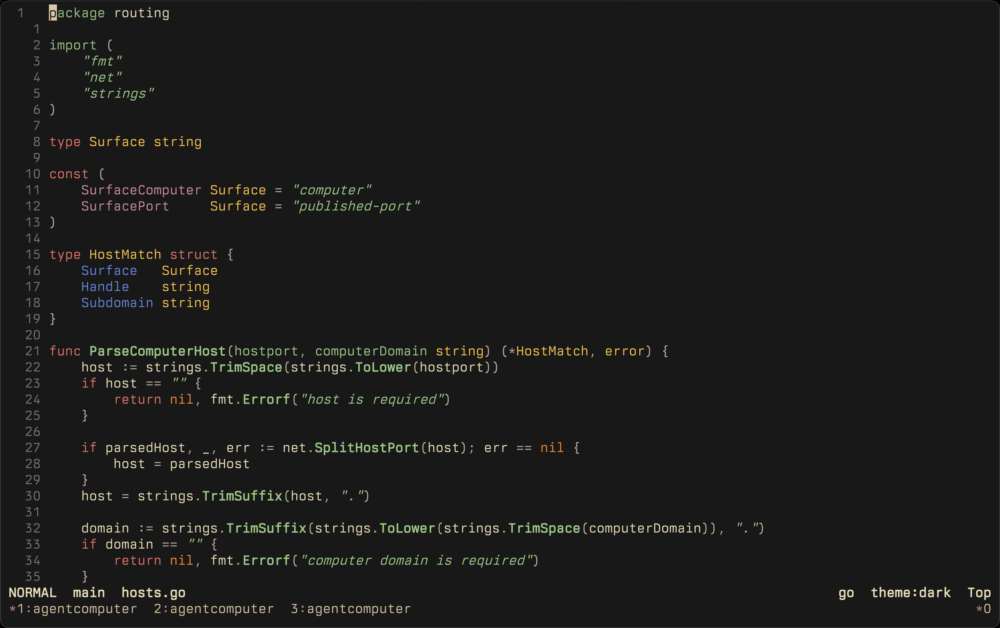
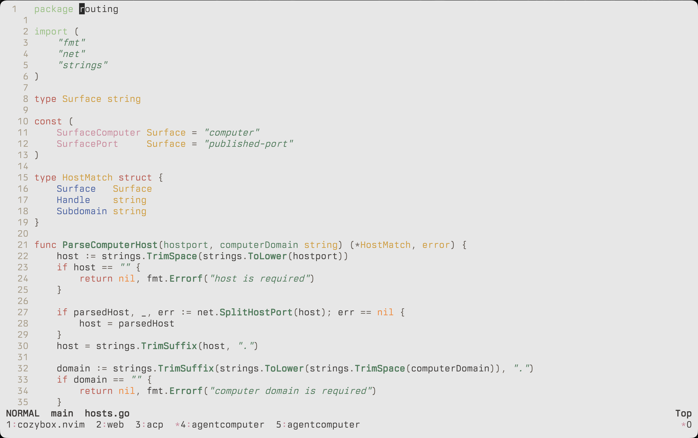

# cozybox.nvim

## Dark


## Light


## Install

Cozybox is a neo style darker gruvbox with havy blue and green accents, a nicer red, and a clean light mode (for outside).

```lua
{ "https://git.harivan.sh/harivansh-afk/cozybox.nvim", priority = 1000 , config = true, opts = ...}
```

Neovim `0.8+`.

## Enable

```vim
set background=dark " or light if you want light mode
colorscheme cozybox
```

## Config

See `:h cozybox.nvim` or `lua/cozybox.lua` for the full option surface.
